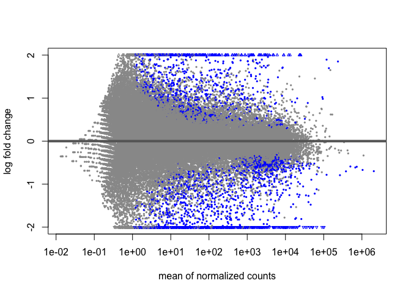
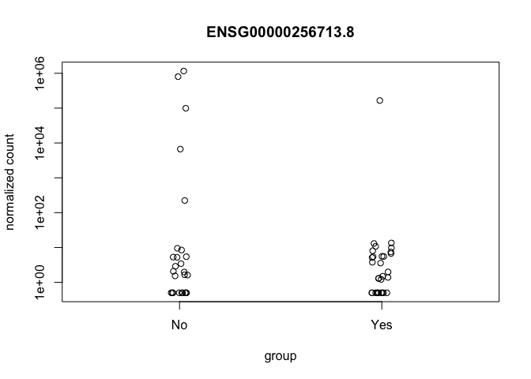
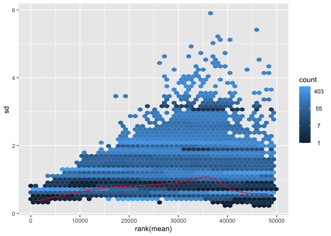
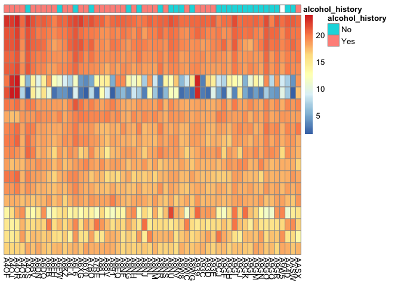
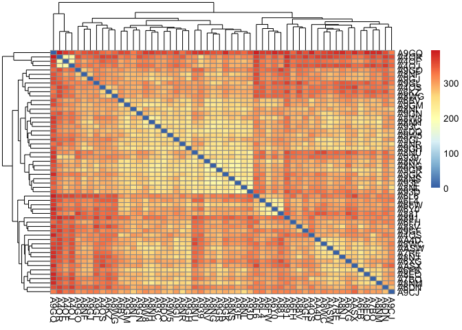
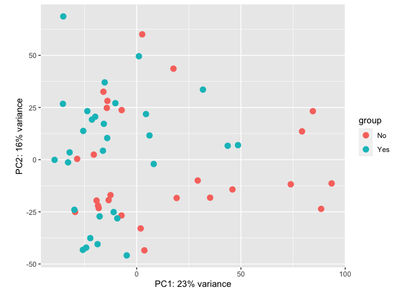
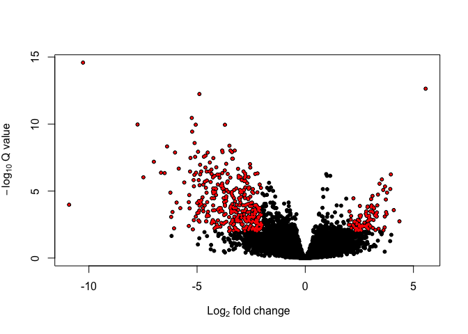
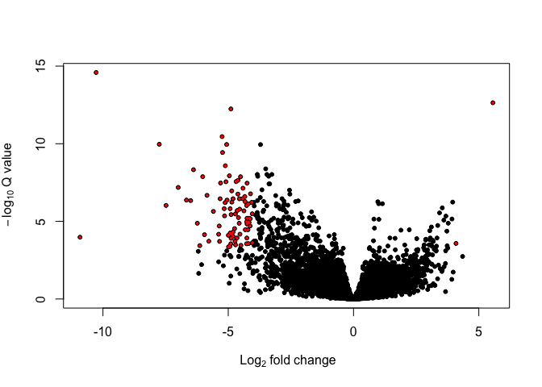

Update
================
Eun K Sung

# **Title**

Differential Gene Expression in TCGA Cohort of Esophageal
Adenocarcinomas comparing by Alcohol Consumption with using DeSEQ2

# **Author**

Eun K. Sung

# **Overview of Project**

I am going to identify different gene expressions between esophageal
adenocarcionmas patients with alcohol consumption history and
non-alcohol consumption history. I utilize GDC Data Portal and have
found 86 samples fit within my cohort. I have picked 30 samples for
alcohol consumption cohort and 28 samples for non-alcohol consumption
cohort. I will utilize the package DeSEQ2 for this differential gene
expression analysis and follow the specific vignette: [Analyzing RNA-Seq
Data with
DeSEQ2](http://bioconductor.org/packages/release/bioc/vignettes/DESeq2/inst/doc/DESeq2.html)

# **Data**

I will use the data from [GDC Data
Portal](https://portal.gdc.cancer.gov/repository) There are 1,138
samples of esophageal adenocarcinomas. By examining clinical data, there
are 86 samples defined by alcohol consumption history. All 28 samples of
non-alcohol consumption history have gene counts file by STAR. I have
selected 30 samples of alcohol consumption history with gene counts file
by STAR.

### Known Issue

Previously I found an issue with outliers due to mis-handling the data.
Here I have fixed the issue and utilized newly scripted “rm_outlier.sh”
to handle the data more efficiently and properly.

## Creating Raw Count Matrix

I will utilize unstrand counts in this differential expression analysis
because I do not know of the strand-specific protocol of this dataset


Change your directory to where you downloaded and saved the "raw_data"
Execute "rm_outlier.sh"
```{bash}
cd /PATH/To/Your/Directory
./rm_outlier.sh
```

Merge all sample count files by paste command. "gene_id.txt" must be the first file when you merge them to create "merged_gene_counts.txt"
```{bash}
paste gene_id.txt A4OF.txt A4OJ.txt A4OR.txt A4OS.txt A4QS.txt A6BV.txt A6DN.txt A6DQ.txt A6FB.txt A6FH.txt A6FW.txt A6KZ.txt A6L4.txt A6L6.txt A6XG.txt A6Y0.txt A7BO.txt A7RE.txt A88T.txt A88V.txt A891.txt A8EQ.txt A8NF.txt A8NG.txt A8NH.txt A8NI.txt A8NJ.txt A8NL.txt A8NM.txt A8NR.txt A8NS.txt A8NU.txt A8NV.txt A8W8.txt A8WC.txt A8WG.txt A939.txt A93C.txt A93D.txt A93E.txt A9CJ.txt A9GF.txt A9GH.txt A9GI.txt A9GJ.txt A9GK.txt A9GL.txt A9GM.txt A9GN.txt A9GO.txt A9GQ.txt A9GR.txt A9W5.txt AA4D.txt AASW.txt AASX.txt > merged_gene_counts.txt
```

## Creating Sample Sheet

I change the sample id in the sample_sheet.tsv in order to match with the sample id in the count_matrix.txt. Also, I change the 1st column name to "sample_id" from "case_submitter_id"

```{bash}
sed 's/^TCGA-.*-//g' sample_sheet.tsv > sample_sheet.tmp && mv sample_sheet.tmp sample_sheet.tsv

sed 's/case_submitter_id/sample_id/g' sample_sheet.tsv > sample_sheet.tmp && mv sample_sheet.tmp sample_sheet.tsv
```

## Load package into your library in RStudio

we are going to utilize these packages through this differential
expression analysis.

``` r
library(tidyverse)
library(tibble)
library(apeglm)
library(ggplot2)
library(vsn)
library(pheatmap)
library(ReportingTools)
library(DESeq2)
```

## Setting Working Directory and Wrangling the Raw Count Matrix and Sample Sheet

``` r
setwd('~/Desktop/final_project')

# Read in the matrix
count_matrix <- read.delim("~/Desktop/raw_data/merged_gene_counts.txt", header=T, sep="\t")

# Change column #1 into row name and delete the column #1 after that
row.names(count_matrix) <- count_matrix$gene_id
count_matrix <- count_matrix[-c(1)]

# Read in the sample sheet
sampletable <- read_tsv('~/Desktop/raw_data/sample_sheet.tsv')
# Change column #1 (sample_id) into row name
row.names(sampletable) <- sampletable$sample_id
```

``` r
# Change data type from character to factor
sampletable$alcohol_history <- as.factor(sampletable$alcohol_history)
```

## Create DESeq2 object

``` r
DES_dataset <- DESeqDataSetFromMatrix(countData = count_matrix,
                                         colData = sampletable,
                                         design = ~ alcohol_history)
```

## Filtering

``` r
# Number of gene before filtering
nrow(DES_dataset)
```

    ## [1] 60660

``` r
# Filtering to keep only rows that have at least 10 reads total
DES_dataset <- DES_dataset[rowSums(counts(DES_dataset)) > 10, ]

# Number of gene after filtering
nrow(DES_dataset)
```

    ## [1] 49403

# Performing standard differential expression analysis

``` r
DES_dataset <- DESeq(DES_dataset)
```

# Using “ReportingTools” to get result table of differential expression analysis

``` r
DES2Report <- HTMLReport(shortName = 'RNAseq_Analysis_with_DEseq2', title = 'Differential Expression Analysis in EAC', reportDirectory = "./reports")
publish(DES_dataset,DES2Report, pvalueCutoff=0.01, annotation.db="org.Mm.eg.db", factor = colData(DES_dataset)$alcohol_history, reportDir="./reports")
finish(DES2Report)
```

    ## [1] "./reports/RNAseq_Analysis_with_DEseq2.html"

This result table is more interactive compare to the regular result
table, which we will make it in the next step.  
I uploaded this interactive to my Github “final_project” repository:

# Generating a result table and print it

``` r
result_table <- results(DES_dataset)
result_table
```

    ## log2 fold change (MLE): alcohol history Yes vs No 
    ## Wald test p-value: alcohol history Yes vs No 
    ## DataFrame with 49403 rows and 6 columns
    ##                      baseMean log2FoldChange     lfcSE      stat     pvalue
    ##                     <numeric>      <numeric> <numeric> <numeric>  <numeric>
    ## ENSG00000000003.15 3241.19579     -0.5965935  0.218054 -2.735993 0.00621923
    ## ENSG00000000005.6     1.42357     -0.2181311  0.595664 -0.366198 0.71421697
    ## ENSG00000000419.13 3057.66540     -0.0487892  0.133888 -0.364403 0.71555692
    ## ENSG00000000457.14 1138.45566     -0.0569172  0.104803 -0.543087 0.58706965
    ## ENSG00000000460.17  766.50595      0.1141778  0.166192  0.687025 0.49206718
    ## ...                       ...            ...       ...       ...        ...
    ## ENSG00000288663.1    59.23404       0.221533  0.153361  1.444521  0.1485924
    ## ENSG00000288667.1     2.60886       0.190300  0.352939  0.539187  0.5897575
    ## ENSG00000288670.1   357.20697      -0.348915  0.154852 -2.253218  0.0242454
    ## ENSG00000288674.1     7.71677       0.318969  0.243687  1.308926  0.1905593
    ## ENSG00000288675.1    38.45201      -0.493466  0.266404 -1.852320  0.0639799
    ##                         padj
    ##                    <numeric>
    ## ENSG00000000003.15 0.0923803
    ## ENSG00000000005.6  0.9018634
    ## ENSG00000000419.13 0.9022197
    ## ENSG00000000457.14 0.8410704
    ## ENSG00000000460.17 0.7887403
    ## ...                      ...
    ## ENSG00000288663.1   0.472762
    ## ENSG00000288667.1   0.842160
    ## ENSG00000288670.1   0.193416
    ## ENSG00000288674.1   0.531989
    ## ENSG00000288675.1   0.317759

# MA-plot to visualize the log2 fold change attributable to a given variable over the mean of normalized counts in the samples in the DES_dataset

``` r
# I will make one plot with the normal data and the other one with shrink the effect size
plotMA(result_table, ylim=c(-2,2))
```

<!-- -->

# Set alpha to 0.05 for p-value and print the summary

``` r
result001 <- results(DES_dataset, alpha = 0.01)
summary(result001)
```

    ## 
    ## out of 49392 with nonzero total read count
    ## adjusted p-value < 0.01
    ## LFC > 0 (up)       : 192, 0.39%
    ## LFC < 0 (down)     : 585, 1.2%
    ## outliers [1]       : 0, 0%
    ## low counts [2]     : 15333, 31%
    ## (mean count < 3)
    ## [1] see 'cooksCutoff' argument of ?results
    ## [2] see 'independentFiltering' argument of ?results

``` r
sum(result001$padj < 0.01, na.rm = TRUE)
```

    ## [1] 777

# Use “plotCounts” function to make a plot for the read counts of single gene across the groups

``` r
plotCounts(DES_dataset, gene = which.min(result001$padj), intgroup = "alcohol_history")
```

<!-- -->

# Extracting transformed values by using variance stabilizing transformation

``` r
vsd <- vst(DES_dataset, blind = FALSE)
head(assay(vsd), 3)
```

    ##                         A4OF      A4OJ      A4OR      A4OS      A4QS      A6BV
    ## ENSG00000000003.15 11.073845 11.849557 12.052456 11.662316 10.896201 10.960192
    ## ENSG00000000005.6   2.629703  3.764245  3.268194  2.800536  2.504987  1.541383
    ## ENSG00000000419.13 10.857319 10.991646 11.309091 11.719676 11.639958 11.157994
    ##                         A6DN      A6DQ      A6FB      A6FH      A6FW      A6KZ
    ## ENSG00000000003.15 11.913989 11.660576  9.855472 10.555575 12.262254 11.639498
    ## ENSG00000000005.6   1.541383  1.541383  1.541383  2.300501  1.541383  2.808877
    ## ENSG00000000419.13 12.479282 11.763541 11.019683 11.388546 11.602909 11.808930
    ##                         A6L4     A6L6      A6XG      A6Y0      A7BO      A7RE
    ## ENSG00000000003.15 12.694263 12.33679 11.323957 13.203509 12.805990 11.738893
    ## ENSG00000000005.6   2.508601  2.80654  3.014142  3.043179  1.541383  1.541383
    ## ENSG00000000419.13 11.672305 12.03525 11.678473 11.226567 12.426050 11.356141
    ##                         A88T      A88V      A891      A8EQ      A8NF      A8NG
    ## ENSG00000000003.15 12.888326 11.383362 12.683453 10.740481 10.367315 11.152924
    ## ENSG00000000005.6   3.818133  1.541383  1.541383  1.541383  1.541383  1.541383
    ## ENSG00000000419.13 11.278743 11.658806 12.333892 10.348557 11.880557 11.129189
    ##                         A8NH      A8NI      A8NJ      A8NL      A8NM      A8NR
    ## ENSG00000000003.15 11.279317 13.173442 10.589044 10.542645 11.340744 10.440734
    ## ENSG00000000005.6   1.541383  1.541383  1.541383  2.554056  2.911876  1.541383
    ## ENSG00000000419.13 11.738838 11.168775 11.434211 11.456001 10.951566 11.408097
    ##                         A8NS      A8NU      A8NV      A8W8      A8WC      A8WG
    ## ENSG00000000003.15 11.473772 10.440441 10.371633 11.230315 11.713746 12.507675
    ## ENSG00000000005.6   3.505982  2.472705  1.541383  1.541383  1.541383  2.663707
    ## ENSG00000000419.13 11.400531 10.699858 11.076113 11.211593 11.279128 11.866248
    ##                         A939     A93C      A93D      A93E      A9CJ      A9GF
    ## ENSG00000000003.15 11.582595 13.09726 10.534959 10.727960 11.177687 11.529211
    ## ENSG00000000005.6   1.541383  2.28282  3.180958  2.564247  2.586056  1.541383
    ## ENSG00000000419.13 11.220530 11.79648 11.263294 11.390059 12.366054 11.318487
    ##                         A9GH      A9GI      A9GJ      A9GK      A9GL      A9GM
    ## ENSG00000000003.15 11.472677 11.585194  9.740227 10.394015 10.397885 11.208539
    ## ENSG00000000005.6   2.961875  1.541383  1.541383  2.809309  2.900136  2.297877
    ## ENSG00000000419.13 11.704887 12.687843 11.462039 11.218784 11.086401 11.984877
    ##                         A9GN      A9GO      A9GQ      A9GR      A9W5      AA4D
    ## ENSG00000000003.15 11.027733 11.511574 11.233588 10.173801 11.933361 12.229037
    ## ENSG00000000005.6   2.291214  1.541383  1.541383  2.307975  1.541383  2.622493
    ## ENSG00000000419.13 11.822275 11.923451 12.091439 10.845460 11.377573 11.969230
    ##                         AASW      AASX
    ## ENSG00000000003.15 11.748620 10.759697
    ## ENSG00000000005.6   3.035708  2.360251
    ## ENSG00000000419.13 11.447008 10.655002

# Effects of transformations on the variance

``` r
# using Variance Stabilizing Transformation (VST)
meanSdPlot(assay(vsd))
```

    ## Found more than one class "simpleUnit" in cache; using the first, from namespace 'ggbio'

    ## Also defined by 'hexbin'

<!-- -->

# Data quality assessment by sample clustering and visualization

``` r
select <- order(rowMeans(counts(DES_dataset,normalized=TRUE)),
                decreasing=TRUE)[1:20]
df <- as.data.frame(colData(DES_dataset)[,c("sample_id", "alcohol_history")])
row.names(df) <- df$sample_id
df <- df[-c(1)]
```

# Using Variance stabilizing transformation to generate a heatmap

``` r
pheatmap(assay(vsd)[select,], cluster_rows=FALSE, show_rownames=FALSE, cluster_cols=FALSE, annotation_col=df)
```

    ## Found more than one class "unit" in cache; using the first, from namespace 'ggbio'

    ## Also defined by 'hexbin'

    ## Found more than one class "simpleUnit" in cache; using the first, from namespace 'ggbio'

    ## Also defined by 'hexbin'

<!-- -->

# Sample-to-Sample distances

``` r
sampleDists <- dist(t(assay(vsd)))
DistMatrix <- as.matrix(sampleDists)
pheatmap(DistMatrix)
```

<!-- -->

# Principal Component Analysis Plot

``` r
plotPCA(vsd, intgroup="alcohol_history")
```

<!-- -->

# Volcano Plot

``` r
with(result_table, plot(log2FoldChange, -log10(padj), pch=20, cex=1.0, xlab=bquote(~Log[2]~fold~change), ylab=bquote(~-log[10]~Q~value)))
with(subset(result_table, padj<0.01 & abs(log2FoldChange)>2), points(log2FoldChange, -log10(padj), pch=20, col="red", cex=0.5))
```

<!-- -->

# Filtering and Count of the resulted

``` r
up <- result_table$log2FoldChange > 3 & result_table$padj < 0.0001
down <- result_table$log2FoldChange < -3 & result_table$padj < 0.0001
table(up)["TRUE"]
```

    ## TRUE 
    ##   12

``` r
table(down)["TRUE"]
```

    ## TRUE 
    ##  117

``` r
up <- result_table$log2FoldChange > 4 & result_table$padj < 0.0005
down <- result_table$log2FoldChange < -4 & result_table$padj < 0.0005
table(up)["TRUE"]
```

    ## TRUE 
    ##    2

``` r
table(down)["TRUE"]
```

    ## TRUE 
    ##   86

# Subsetting, formatting into dataframe, and Merging to create **data matrix** with abs(Log2FoldChange \> 4 & padj\<0.0005

``` r
up_sub <- subset(result_table, abs(log2FoldChange) > 4 & padj < 0.0005)
Sig_dataset <- as.data.frame(up_sub)
gene_id <- tibble::rownames_to_column(Sig_dataset, "gene_id")
gene_id <- c(gene_id$gene_id)
gene_id <- as.data.frame(gene_id)
# Read in Data Matrxi
count_geneid <- read.delim("~/Desktop/raw_data/merged_gene_counts.txt", header=T, sep="\t")
sig_df = count_geneid %>% inner_join(gene_id,by="gene_id")
# Change column #1 into row name and delete the column #1 after that
row.names(sig_df) <- sig_df$gene_id
sig_df <- sig_df[-c(1)]
```

# Create DESeq2 object

``` r
Sig_DES <-  DESeqDataSetFromMatrix(countData = sig_df,
                                         colData = sampletable,
                                         design = ~ alcohol_history)
```

# Performing standard differential expression analysis

``` r
Sig_DES <- DESeq(Sig_DES)
```

    ## estimating size factors

    ## estimating dispersions

    ## gene-wise dispersion estimates

    ## mean-dispersion relationship

    ## -- note: fitType='parametric', but the dispersion trend was not well captured by the
    ##    function: y = a/x + b, and a local regression fit was automatically substituted.
    ##    specify fitType='local' or 'mean' to avoid this message next time.

    ## final dispersion estimates

    ## fitting model and testing

    ## -- replacing outliers and refitting for 37 genes
    ## -- DESeq argument 'minReplicatesForReplace' = 7 
    ## -- original counts are preserved in counts(dds)

    ## estimating dispersions

    ## fitting model and testing

# Extracting transformed values by using variance stabilizing transformation

``` r
Sig_vsd <- vst(DES_dataset, blind = FALSE)
```

# PCA

``` r
plotPCA(Sig_vsd, intgroup="alcohol_history")
```

<!-- -->

# Volcano Plot with abs(Log2FoldChange \> 4 & padj\<0.0005

``` r
with(result_table, plot(log2FoldChange, -log10(padj), pch=20, cex=1.0, xlab=bquote(~Log[2]~fold~change), ylab=bquote(~-log[10]~Q~value)))
with(subset(result_table, padj<0.0005 & abs(log2FoldChange)>4), points(log2FoldChange, -log10(padj), pch=20, col="red", cex=0.5))
```

<!-- -->

# Using Variance stabilizing transformation to generate a heatmap

``` r
pheatmap(assay(Sig_vsd)[select,], cluster_rows=FALSE, show_rownames=FALSE, cluster_cols=FALSE, annotation_col=df)
```

<!-- -->
